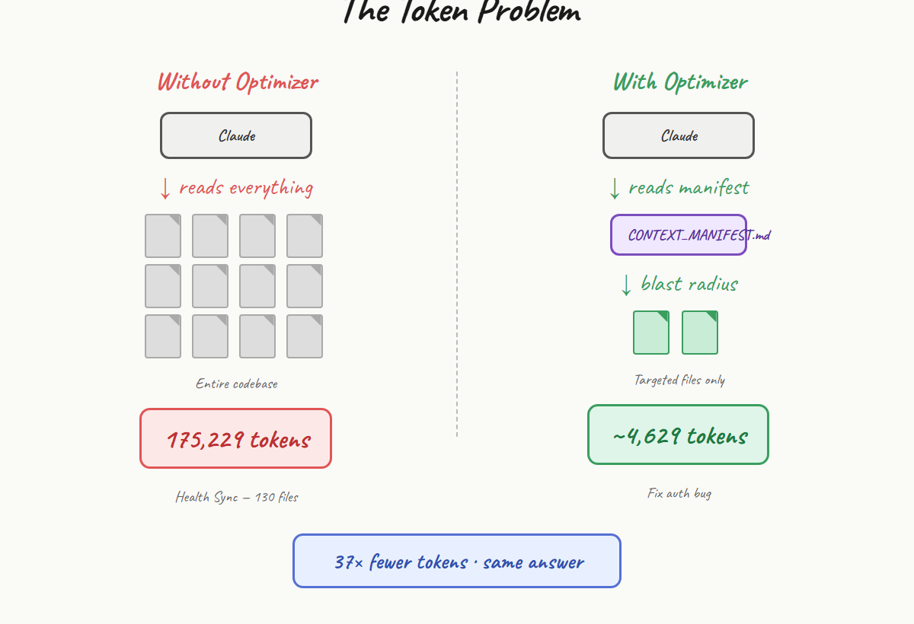
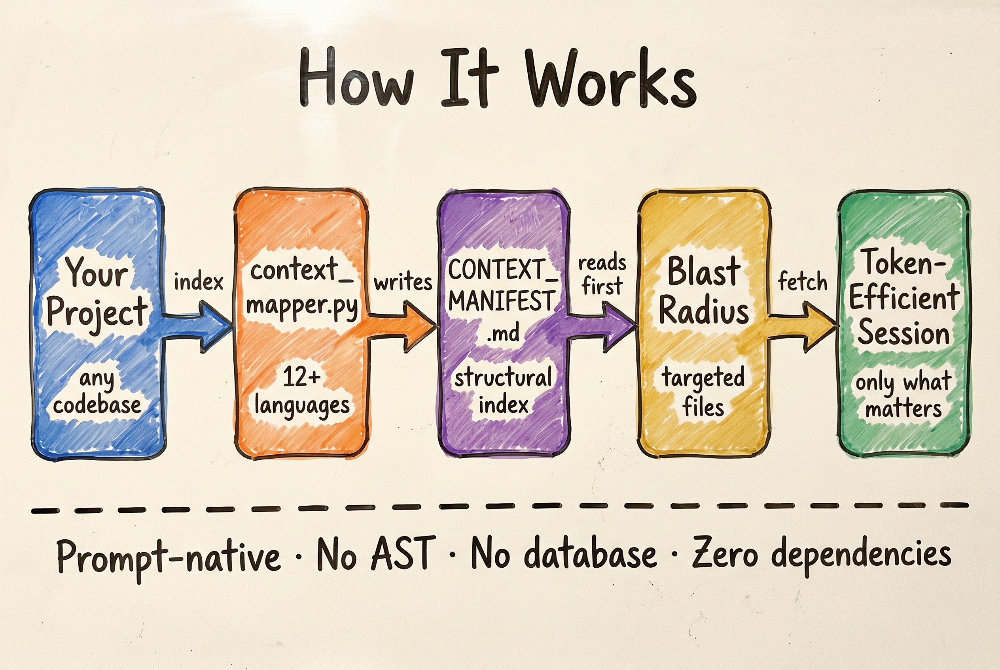
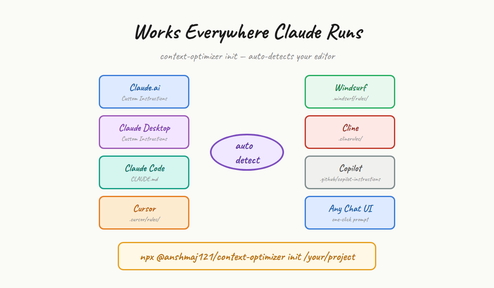
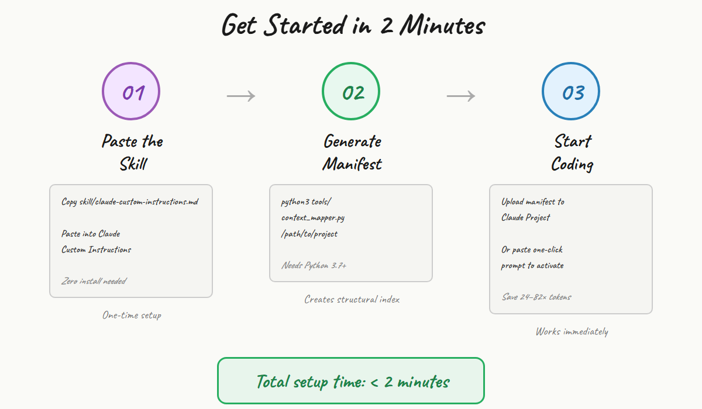

# context-optimizer

**No setup required to start.**

Use the skill alone — paste into Claude, works immediately.  
Add Python 3.7+ to unlock auto-manifest generation.

[](https://opensource.org/licenses/MIT)

| Tool | What it cuts | Install needed |
|------|-------------|----------------|
| 🪨 [Caveman](https://github.com/JuliusBrussee/caveman) | Output tokens (~75%) | One command |
| 🔬 [code-review-graph](https://github.com/tirth8205/code-review-graph) | Input tokens (8.2x²) | pip + Python 3.10+ |
| 🗜️ Context Optimizer | Input tokens (see benchmarks) | Zero to start |

² [code-review-graph benchmarks](https://github.com/tirth8205/code-review-graph#benchmarks)

## Why This Exists

Claude has a **200K token context window** — but burning 20K tokens just to show a directory structure is wasteful. This toolkit teaches Claude to **fetch only what it needs**, **compress what it sees**, and **reason structurally** instead of reading raw files.

**No API hacks. No leaked code. No reverse engineering.**
Just official Claude features (Custom Instructions + Projects + Knowledge) and a lightweight local indexer.

## Benchmarks

| Project | Files | Peak reduction | Avg reduction |
|---------|-------|---------------|---------------|
| shadcn/ui (public) | 55 components | **116x** | **~82x** |
| Health Sync (private React + Firebase) | 130 files | **37x** | **~24x** |

### shadcn/ui — 55 components, 46,071 tokens total

| Task | Files needed | With optimizer | Without | Reduction |
|------|-------------|----------------|---------|-----------|
| Add variant to Button | 1 (`button.tsx`) | 397 tokens | 46,071 | **116x** |
| Fix focus ring accessibility | 2 (`button` + `input`) | 559 tokens | 46,071 | **82x** |
| Add size prop to Card | 1 (`card.tsx`) | 538 tokens | 46,071 | **85x** |
| Update Dialog behavior | 1 (`dialog.tsx`) | 971 tokens | 46,071 | **47x** |
| **Average** | | | | **~82x** |

### Health Sync — 130 files, React + Firebase

| Task | With optimizer | Without | Reduction |
|------|----------------|---------|-----------|
| Fix auth bug | 4,629 tokens | 175,229 | **37x** |
| Debug food scanner | 6,656 tokens | 175,229 | **26x** |
| Add dashboard widget | 8,805 tokens | 175,229 | **20x** |
| Update nutrition UI | 13,363 tokens | 175,229 | **13x** |
| **Average** | | | **~24x** |

*Methodology: file sizes ÷ 4 (standard approximation). "Without" = all files in scope. Reproduce: `python3 tools/context_mapper.py`*

---

## The Token Problem

<p align="center"></p>

## How It Works

<p align="center"></p>

## Works Everywhere Claude Runs

<p align="center"></p>

## Get Started in 2 Minutes

<p align="center"></p>

---

## How it works in practice

Without Context Optimizer, Claude reads every file it thinks might be relevant — often 10–15 files before answering.

With Context Optimizer, Claude reads the manifest first, fetches 2–3 targeted files, then answers. Same result. Fraction of the context.

## Quick Start

### Tier 1 — Zero install (30 seconds)

Paste `skill/claude-custom-instructions.md` into Claude Custom Instructions or any chat. Done.

1. Copy the contents of [`skill/claude-custom-instructions.md`](skill/claude-custom-instructions.md)
2. Paste into Claude Settings → Custom Instructions
3. Claude immediately starts reasoning from structure, not scanning files

### Tier 2 — With manifest generator (Python 3.7+)

```bash
npm install -g @anshmaj121/context-optimizer
context-optimizer init ./your-project
python3 tools/context_mapper.py ./your-project
```

Upload the generated `CONTEXT_MANIFEST.md` to a Claude Project as Knowledge. Every session after that runs lean.

> **macOS/Linux:** `npx @anshmaj121/context-optimizer init ./your-project` also works.  
> **Windows:** use the two-line form above — npx has a known bin resolution bug with scoped packages on Windows.

## How It Works

```
Your Project
    │
    ▼
context_mapper.py ──► CONTEXT_MANIFEST.md
                            │
                            ▼
                    Claude Project Knowledge
                            │
                            ▼
                    skill/claude-custom-instructions.md
                    (via Custom Instructions or CLAUDE.md)
                            │
                            ▼
                    Token-Efficient Claude Sessions
```

### The Three Pillars

**1. CONTEXT_MANIFEST.md** — A structural index of your codebase: file paths, languages, line counts, import graphs, and blast-radius data. Claude reads this instead of scanning directories.

**2. Core Skill** — Custom instructions that enforce structural reasoning, limit file fetches to 3/turn, and compress all output into a strict format.

**3. Session Activator** — A one-click prompt to paste at the start of any session when you can't use Custom Instructions.

## File Structure

```
context-optimizer/
├── context-optimizer-skill/
│   ├── SKILL.md                     # Skill with YAML frontmatter (for skill registries)
│   └── LICENSE.txt
├── skill/
│   └── claude-custom-instructions.md  # Paste into Claude Custom Instructions
├── prompt/
│   └── one-click-vertical-prompt.md   # Paste at start of any session
├── scripts/
│   └── install.sh                   # Full-stack installer (idempotent)
├── tools/
│   └── context_mapper.py            # Manifest + dependency graph generator
├── .claude/
│   ├── COMMON_MISTAKES.md           # Project-specific bug history
│   ├── QUICK_START.md               # Daily commands
│   └── ARCHITECTURE_MAP.md          # High-level routing & layers
├── .claudeignore                    # Files excluded from Claude's context
└── docs/
    ├── learnings/                   # Session insights (gitignored)
    └── archive/                     # Old versions (gitignored)
```

## Usage Guide

### Option A: Claude Projects (Recommended)
1. Run `python3 tools/context_mapper.py /your/project`
2. Upload `CONTEXT_MANIFEST.md` to a Claude Project as Knowledge
3. Add `skill/claude-custom-instructions.md` to Project Instructions
4. Start chatting — Claude will reason from the manifest automatically

### Option B: Custom Instructions (Global)
1. Go to Claude Settings → Custom Instructions
2. Paste the contents of `skill/claude-custom-instructions.md`
3. For each project, paste `CONTEXT_MANIFEST.md` into the chat or upload it

### Option C: Per-Session Activation
1. Open any Claude chat
2. Paste `prompt/one-click-vertical-prompt.md` as your first message
3. Claude confirms: `✅ Context Optimizer active.`
4. Upload or paste `CONTEXT_MANIFEST.md` and start your task

### Option D: Claude Code / CLAUDE.md
Run the installer — it auto-detects `.claude/` and injects the skill into `CLAUDE.md`:
```bash
./scripts/install.sh /your/project
```

## Manifest Generator

```bash
# Basic usage
python3 tools/context_mapper.py /path/to/project

# Blast-radius analysis (find all files affected by a change)
python3 tools/context_mapper.py /path/to/project --blast-radius src/auth.py,src/models.py
```

**Output files:**
- `CONTEXT_MANIFEST.md` — Human + AI readable manifest
- `.claude/graph.json` — Machine-readable dependency graph

## Overrides & Controls

| Command | Effect |
|---------|--------|
| `RELOAD CONTEXT OPTIMIZER` | Reset all rules for this session |
| `MAX_FILES: 5` | Allow up to 5 files per turn |
| `BUDGET: 2000` | Raise token budget to 2,000 |
| `COMPRESSION: lite` | Less aggressive compression |
| `TEMP VERBOSE` | One-turn verbose mode, then revert |

## Contributing

See [CONTRIBUTING.md](CONTRIBUTING.md). PRs welcome — especially for new language parsers in `context_mapper.py`.

## Ecosystem

| Tool | Role |
|------|------|
| [Caveman](https://github.com/JuliusBrussee/caveman) | Cuts Claude **output** tokens (~75%) |
| [context-optimizer](https://github.com/anshmajumdar121/context-optimizer) | Cuts Claude **input** tokens (13–116x) |
| [code-review-graph](https://github.com/tirth8205/code-review-graph) | Input tokens for large monorepos with git history (8.2x) |

Best results: install Caveman + Context Optimizer together. They solve opposite sides of the same problem.

## License

MIT — see [LICENSE](LICENSE).
